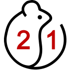
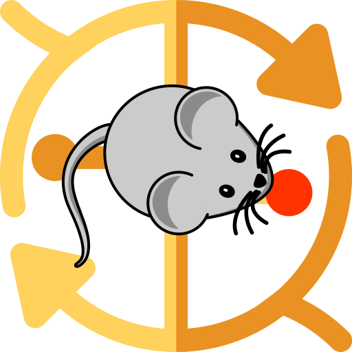
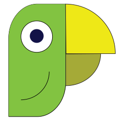

## Projects Overview

- **[LORA](https://github.com/IPHYS-Bioinformatics/LORA)** - LORA: Lipid Over-Representation Analysis.
- **[CRediT Generator](https://github.com/IPHYS-Bioinformatics/CRediT-Generator)** - Summarizes authors' contributions to a scientific paper in a standardized way for publication in a journal. 
- **[Burn your fat!](https://github.com/IPHYS-Bioinformatics/Burn_your_fat)** - Biochemistry DIY board game :game_die:

- **[MQanalyser](https://github.com/svalvaro/MQanalyser)**# - Interactive analysis of proteomics data (mainly MaxQuant)
- **[ProteoViewer](https://github.com/svalvaro/ProteoViewer)**# - Peptide intensities mapped on the protein topology visualized by the Protter
- **[MQmetrics](https://github.com/svalvaro/MQmetrics)**# - R package for the Quality Control report based on the MaxQuant output
  #misc. proteotools developed by our former colleague Alvaro Sanchez

## Core Facilities
- **[Metabolomics](https://metabolomics.fgu.cas.cz/index.html)** - Metabolomics at IPHYS.
- **[Proteomics](https://fgu.cas.cz/en/research-and-laboratories/service-departments/proteomics-service-laboratory/)** - Proteomics at IPHYS, [GitHub](https://github.com/ProteoLabKRC).
- **[Bioimaging](https://bioimaging.fgu.cas.cz/)** - Bioimaging at IPHYS, [GitHub](https://github.com/IPHYS-BIF)

## Online Web Resources
-  **[MetaboAtlas21](https://metaboatlas21.metabolomics.fgu.cas.cz)** - Comprehensive atlas of the mouse metabolome and lipidome accross 21 organs
-  **[GTTAtlas](https://gttatlas.metabolomics.fgu.cas.cz)** - Metabolomics atlas of mouse tissues during oral glucose tolerance test using [13C6]-glucose as a tracer
-  **[COMA](https://coma.metabolomics.fgu.cas.cz)** - Circadian ontogenetic metabolomics atlas of rat plasma, tissues and feces
-  **[LORA](https://lora.metabolomics.fgu.cas.cz)** - LORA: Lipid Over-Representation Analysis
-  **[CRediT Generator](https://credit.metabolomics.fgu.cas.cz)** - CRediT Generator online app
-  **[QR code Generator](https://qr.metabolomics.fgu.cas.cz)** - IPHYS QR code generator online app
- **[ProteoViewer](https://proteomics.fgu.cas.cz/ProteoViewer/)**
- **[ProteoAnalyser](https://proteomics.img.cas.cz/mqa/)**

## Complexome data analysis
- [GIPit](https://github.com/Rayyan-Tariq-Khan/GIPit) - Gaussian Interaction Profiler workflow (formerly known as Easy-GIP)
- [ProteoViz](https://github.com/Rayyan-Tariq-Khan/ProteoViz) - Complexomics data visualization workflow 

<!--

**Here are some ideas to get you started:**

🙋‍♀️ A short introduction - what is your organization all about?
🌈 Contribution guidelines - how can the community get involved?
👩‍💻 Useful resources - where can the community find your docs? Is there anything else the community should know?
🍿 Fun facts - what does your team eat for breakfast?
🧙 Remember, you can do mighty things with the power of [Markdown](https://docs.github.com/github/writing-on-github/getting-started-with-writing-and-formatting-on-github/basic-writing-and-formatting-syntax)
-->
